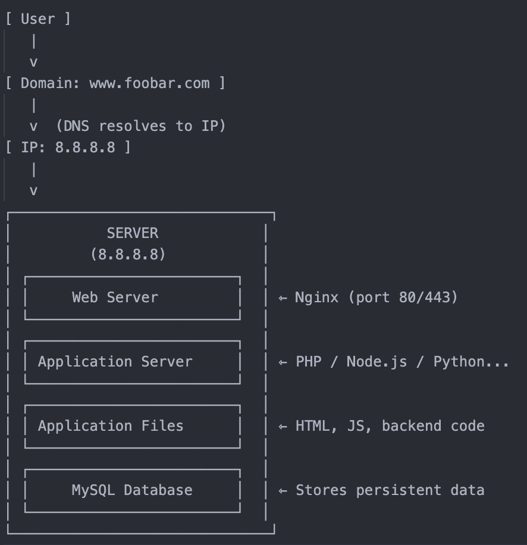

Task 0: Simple web stack

User Access Flow:

1. A user opens a browser and types www.foobar.com.
2. The browser queries a DNS server: "What is the IP address of www.foobar.com?"
3. DNS responds with 8.8.8.8 (the IP of our server).
4. The browser sends an HTTP/HTTPS request to 8.8.8.8.
5. The server receives the request, and Nginx (the web server) handles it.
6. Nginx forwards the request to the application server (e.g., PHP, Node.js).
7. The application executes code (application files).
8. If data is needed, it queries the MySQL database.
9. A response (HTML) is sent back to the user via Nginx.

Component Definitions:
1. What is a server?

A physical or virtual computer that provides services to other computers
In this case, it hosts all the components needed to serve the website
Has its own IP address (8.8.8.8)

2. Role of the domain name (foobar.com)

Human-readable address that maps to the server's IP address
Easier to remember than numerical IP addresses
Provides a consistent access point even if server IP changes

3. DNS Record Type - www

"www" is a subdomain configured with an A record
A record (Address record) maps the hostname to IPv4 address
Points www.foobar.com → 8.8.8.8

4. Role of the web server (Nginx)

Handles incoming HTTP/HTTPS requests
Serves static content (images, CSS, JavaScript)
Acts as reverse proxy to application server
Manages SSL/TLS encryption
Load balancing (in more complex setups)

5. Role of the application server

Executes dynamic application logic
Processes business rules
Handles user sessions
Generates dynamic content
Communicates with database

6. Role of the database (MySQL)

Persistent data storage
Structured data management
Query processing
Data integrity and transactions
User data, content, configurations

7. Server-User Communication

Uses HTTP/HTTPS protocol
Built on top of TCP/IP
Port 80 for HTTP, Port 443 for HTTPS
Request-response model

Infrastructure Issues:
1. SPOF (Single Point of Failure)

If the single server fails, the entire website goes down.

2. Maintenance Downtime

Restarting Nginx, updating code, or modifying the database requires stopping services, leading to temporary unavailability.

3. Scalability Limitations

If traffic increases significantly, the server can become overwhelmed.

It cannot horizontally scale (add more servers), so performance drops or the site crashes.