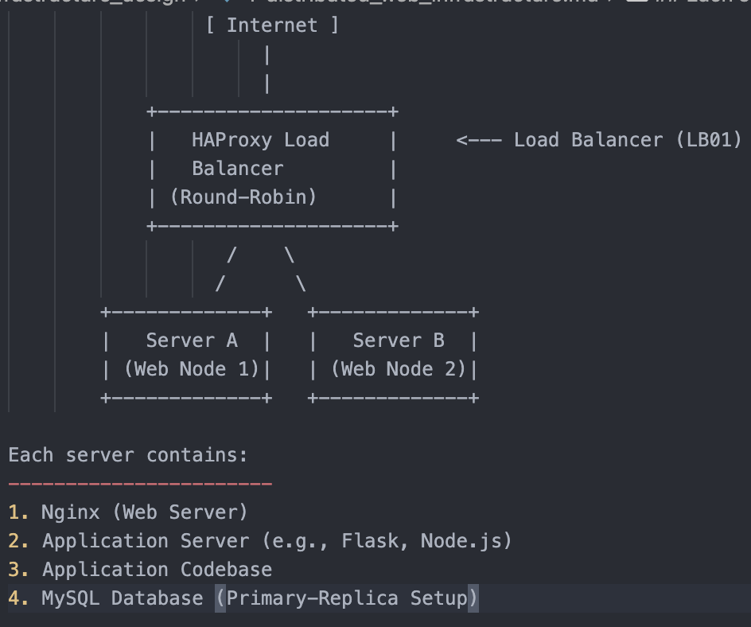

Task 1:

Component Explanations:

1. HAProxy (Load Balancer):

Purpose: Distributes incoming HTTP requests to backend servers.

Why? Improves performance, availability, and reliability.

Load Distribution Algorithm: Round-Robin

How it works: Incoming requests are assigned to servers in a circular order, balancing load evenly.

Active-Active Setup:

Explanation: Both Server A and Server B actively handle requests concurrently.

Contrast with Active-Passive: In Active-Passive, one server is on standby and only takes over if the active one fails.

2. Nginx (Web Server):

Purpose: Handles client HTTP requests and serves static files.

Why? Efficient, fast reverse proxy, good for handling high loads.

3. Application Server:

Purpose: Executes the dynamic parts of the website (e.g., PHP, Python, Node.js).

Why? Separates concerns between static content and backend logic.

4. Application Files:

Purpose: Contains codebase (HTML, JS, backend logic).

Why? Core of your product functionality.

5. MySQL (Database) with Primary-Replica Setup:

Primary Node:

Handles write operations (INSERT, UPDATE, DELETE).

Replica Node:

Handles read-only operations (SELECT).

Replication: Automatically receives updates from the Primary.

Why? Reduces load on the Primary and increases read performance and fault tolerance.

Infrastructure Issues:

1. SPOFs (Single Points of Failure):

HAProxy: If it fails, the whole system becomes inaccessible.

Database Primary: If it crashes, writes can’t be performed.

No Failover for DB or LB.

2. Security Issues:

No HTTPS: Data in transit is unencrypted.

No Firewall or Security Groups: All ports are potentially exposed to the internet.

No Intrusion Detection/Prevention: Susceptible to attacks.

3. No Monitoring:

Cannot track downtime, resource utilization, or failures.

No alerting system for server crashes, DB lag, or high load.

