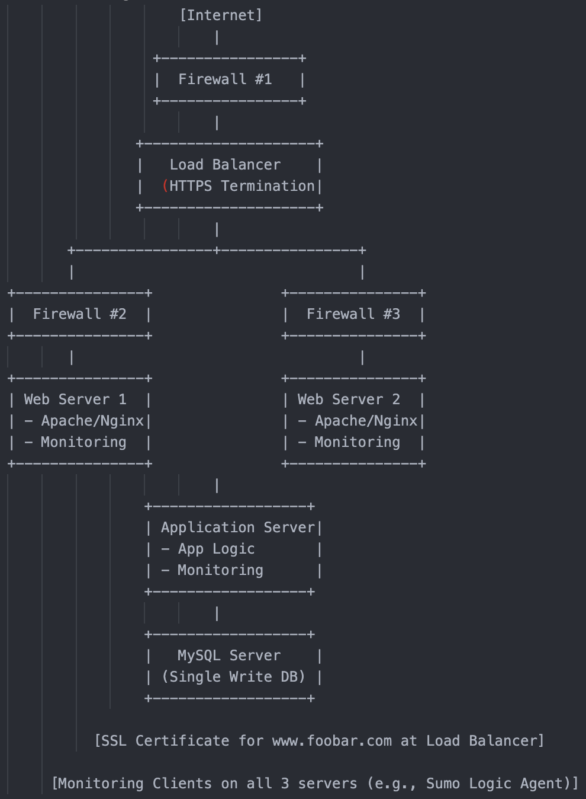

Task 2:

INFRASTRUCTURE COMPONENTS & JUSTIFICATIONS:

1. Firewalls (3)
Firewall #1: Sits at the edge of the infrastructure and filters external internet traffic.

Firewall #2 & #3: Control internal east-west traffic, e.g., between web servers and app/database layers.

Purpose: Protect systems by restricting unauthorized access and minimizing attack surfaces.

2. SSL Certificate
Installed on the Load Balancer to serve traffic over HTTPS for www.foobar.com.

Purpose: Encrypts data in transit to prevent eavesdropping or MITM (man-in-the-middle) attacks.

3. Monitoring Clients (3 total)
One on each server: Web Server 1, Web Server 2, and Application Server.

Example Tools: Sumo Logic, Prometheus, Datadog agents.

Purpose: Tracks system health, logs, metrics, and sends data to a centralized monitoring service.

EXPLANATIONS & BEST PRACTICES:

1. Why HTTPS?
Ensures data confidentiality and integrity.

Protects against packet sniffing and session hijacking.

Improves SEO and user trust.

2. What Is Monitoring Used For?
Real-time visibility into application health.

Troubleshooting and debugging.

Alerting on anomalies, downtime, performance degradation.

3. How Monitoring Collects Data
Lightweight agents (Sumo Logic collectors, Prometheus node_exporter, etc.) installed on each host.

Collect metrics like CPU, memory, disk, HTTP request count, error rates.

Push or pull this data to/from a monitoring backend.

4. How to Monitor Web Server QPS (Queries Per Second)
Enable request logging (e.g., Nginx logs).

Use tools like:

Prometheus + Grafana with exporters.

Sumo Logic to parse web server logs and calculate requests over time.

Log-based metrics: Count log entries with HTTP requests per time window.

INFRASTRUCTURE ISSUES & TRADEOFFS:

1. Terminating SSL at Load Balancer
Issue: Traffic between the load balancer and backend servers is unencrypted.

Risk: Internal threats or compromised infrastructure could intercept unencrypted data.

Solution: Use end-to-end encryption (TLS passthrough or re-encrypt traffic to backend).

2. Single MySQL Server (Write Capable)
Issue: Single point of failure; no high availability or write scalability.

Impact: If the MySQL server crashes, the site can’t process transactions.

Solution: Use MySQL replication with failover, Galera cluster, or Aurora Multi-AZ setups.

3. All Servers Have All Components
Issue: Poor separation of concerns; difficult to scale individual layers (web, app, DB).

Risk: Leads to tight coupling and resource contention (e.g., DB and app fighting for RAM).

Solution: Separate web, application, and database tiers for cleaner architecture and better scalability.