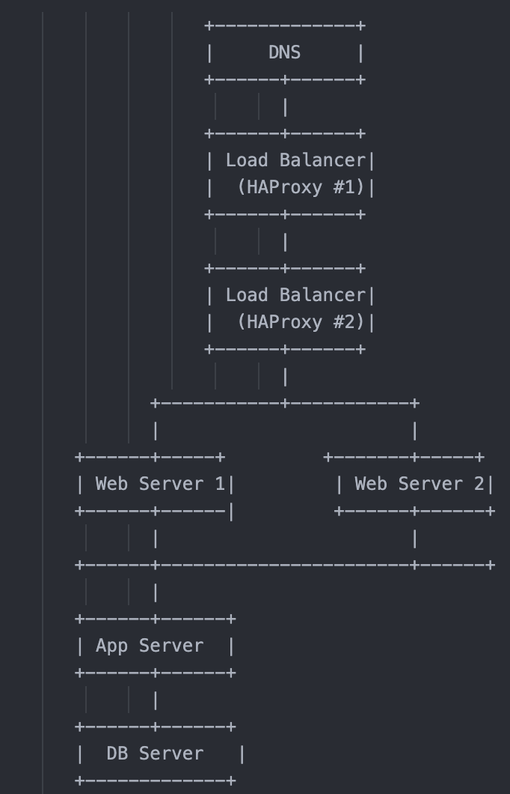

# Web Infrastructure - Scale Up

## Description

This document describes a scalable web infrastructure setup that ensures high availability, redundancy, and separation of concerns. It includes multiple servers handling different roles, along with a load balancing solution configured in active-passive mode.

---

## Infrastructure Diagram

---

## Components & Roles

### 1. Load Balancers (HAProxy Cluster)
- **Number**: 2 (configured in active/passive mode)
- **Purpose**: Distribute client requests to the web servers, ensuring load balancing and high availability.
- **Why?**: Prevents downtime by providing a failover load balancer and ensures even traffic distribution.

### 2. Web Servers
- **Number**: 2
- **Purpose**: Handle HTTP requests, serve static content.
- **Why?**: Improves performance and fault tolerance through redundancy.

### 3. Application Server
- **Number**: 1
- **Purpose**: Hosts the application’s logic (e.g., API, backend scripts).
- **Why?**: Decoupling logic from web layer allows for independent scaling and easier maintenance.

### 4. Database Server
- **Number**: 1
- **Purpose**: Store and manage application data.
- **Why?**: Dedicated DB improves security and performance; simplifies backups and scaling.

---
